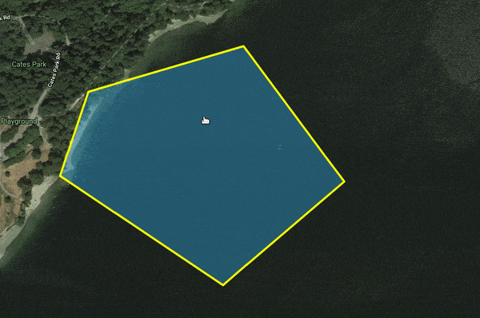

# Closest Point Detector

## What This Does : 

```
  closest-point-detector helps `detect and determine` the `Point or Vertex` on a Polygon that is the closest to a particular external Point.
```



## API: 
```
  FindNearestPointOnPolygon(<polygon-geojson>, <point-geojson>, <threshold>)
  FindNearestVertexOnPolygon(<polygon-geojson>, <point-geojson>, <threshold>)

  @ Param: 
    polygon-geojson: GeoJSON data of a polygon.
    point-geojson: GeoJSON data of a point.
    threshold: the threshold distance to detect point/vertex. 
        If the distance detected point/vertex and the <point-geojson> is more than <threshold>,
        The functions will return `null`
  NOTE: the coordinate system: lat-lng used here is the same as Google Map's
  @ Return: 
    null ||
    {
      type: 'Point',
      coordinates: [Number, Number],
      distance: Number,
      idPoly: Number - The detected index of the vertex on the polygon (when we look for nearest vertex).
    }
    
```

## Examples

```javascript
import { 
  FindNearestPointOnPolygon as detectNPoint 
  FindNearestVertexOnPolygon as detectNVertex
} from 'closest-point-detector'
const polygon = {
  type: 'Polygon',
  coordinates: [[ [0,0], [0,10], [5,5], [0,0] ]]
}
const point = {
  type: 'Point',
  coordinates: [-2, 1]
}

const closestPoint = detectNPoint(polygon, point, 4) // geoJSON of [0,1]
const closestVertex = detectNVertex(polygon, point, 4) // geoJSON of [0,0]
```
## Installation

```sh

$ npm install closest-point-detector

```

## Testing: 

```sh
  npm install --dev jest 
  npm install babel-preset-env
  npm test
```
